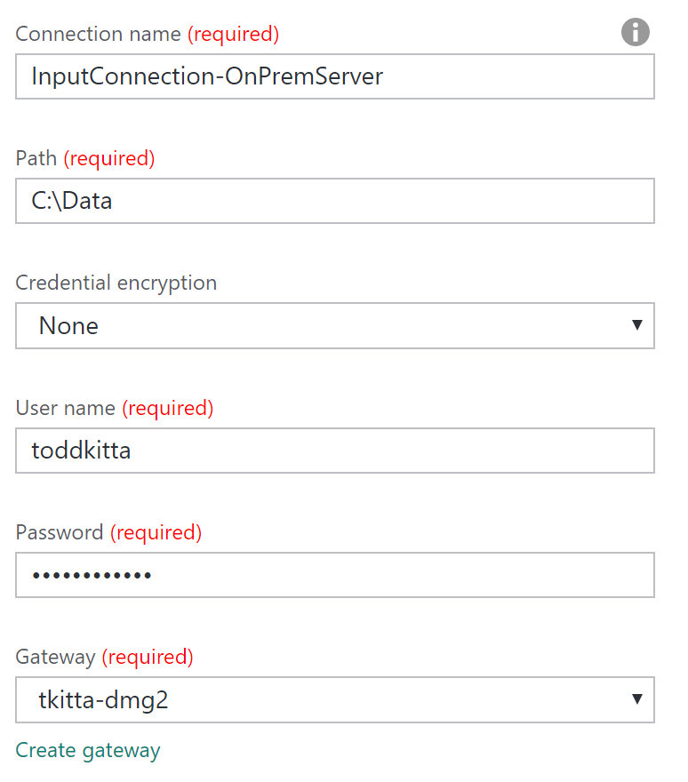
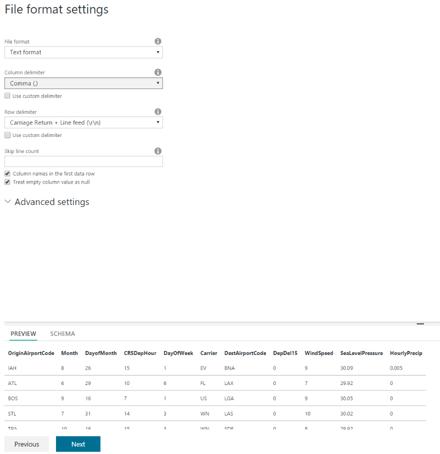
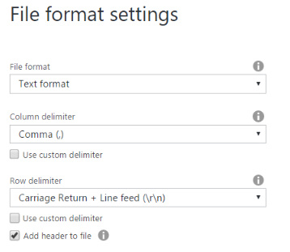
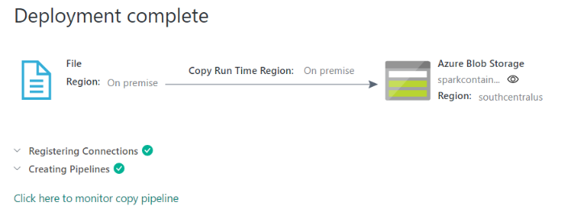

# Exercise 3: Develop Data Factory Pipeline for Data Movement

Duration: 20 mins

Synopsis: In this exercise, attendees will implement Azure Data Factory pipeline to copy data (.csv file) from on-premises server (lab virtual machine) to Azure Blob Storage. The goal of the exercise is to demonstrate data movement from an on-premises location to Azure Storage (via the Data Management Gateway). The attendee will see how these assets are created, deployed, executed, and monitored.

## Task 1: Create Copy Pipeline Using the Copy Data Wizard

1. Go the Azure Portal and select Azure Data Factory (ADF) Service you create in previous exercise.

    

1. From **Actions** section, click on **Copy data**.

    

1. New browser window will open.  Under Properties tab, type in **CopyPipeline–OnPrem2Azure**.

    

1. Optional: Type in a description like: **This pipeline copies CSV file from on-premises virtual machine C:\Data to Azure Blob Storage as a one-time job**.
2. Select the **Run once now** option.
3. Click on the **Next** button from the bottom of the screen.
4. From the Source Data Store screen tab, select **File**.

    

1. Click on **Next** button from the bottom of the screen.
2. From the Specify File Server share connection tab, type **InputLinkedService-OnPremServer** into the **Linked service name**.
3. For the **Path** , type in **C:\Data**.
4. For the **User name** , type in the user name that was used to log into the lab virtual machine.
5. For the **Password** , type in the password that was used to log into the lab virtual machine.
6. For the Gateway, it should already be filled in with the gateway connection you created in the previous exercise.

    

1. Click on the **Next** button from the bottom of the screen.
2. From the **Choose the input file or folder** tab, click on the **FlightsAndWeather.csv**.
3. Click on the **Choose** button from the bottom right corner of the screen.
4. Click on the **Next** button from the bottom of the screen.

    

1. From the File format settings tab, leave everything as defaulted except check the box **Column name in the first data row**.  You can see the preview of the file from the bottom of the screen.
2. Click **Next** button from the bottom of the screen.

    

1. From the **Destination data store** tab, click on the **Azure Blob Storage**.
2. Click on the **Next** button from the bottom of the screen.

    

1. From the **Specify the Azure Blob storage account** tab, Type in **OutputLinkedService-AzureBlobStorage** into the **Linked service name**.
2. From the **Storage account name** dropdown list, select **&lt;YOUR\_APP\_NAME&gt;sparkstorage**.
3. Click on the **Next** button from the bottom of the screen.

    

1. From the Choose the output file or folder tab, type in **sparkcontainer/flights** into the **folder path** textbox.
2. Click on the **Next** button from the bottom of the screen.

    

1. From the File format settings tab, leave everything as defaulted except check the box **Add header to file**. You can see the preview of the file from the bottom of the screen.
2. Click **Next** button from the bottom of the screen.

    

1. Review the summary tab and click **Finish** button from the bottom.
2. You should see a **Deploying** status. This process will take few minutes and see the **Deployment Complete** status on top of the screen.

    

1. Click on the hyperlink **Click here to monitor copy pipeline**.
2. From the **Resource Explorer** , you should see from the **Activity Windows** (bottom of the screen) the pipeline activity status **Ready**. This indicates the CSV file was successfully copied from your VM to your Azure Blob Storage location.

    

Next Exercise: [Exercise 4 - Operationalize ML Scoring with Azure ML and Data Factory](04 Exercise 4 - Operationalize ML Scoring with Azure ML and Data Factory.md)