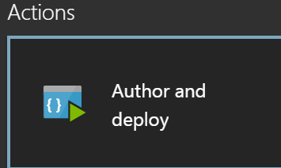

## Exercise 4: Operationalize ML Scoring with Azure ML and Data Factory

Duration: 20 mins

Synopsis: In this exercise, attendees will extend the Data Factory service to operationalize the scoring of data using the previously created ML model.

### Task 1: Create Azure ML Linked Service

1. Go back to the **Azure Data Factory** service blade.
2. Click on the **Author and deploy** from **Actions** section.

    

1. Click on **…More**.

    

1. Click on **New Compute**.

    

1. Select **Azure ML** from the list.
2. In the new window, be sure change the JSON file to match the following:
  1. In the new window, be sure change the JSON file to match the following or copy the below JSON text and paste into the browser window. You can also copy this from **Listing 1** in [http://aka.ms/adfcode](http://aka.ms/adfcode).
  2. Be sure to follow steps 7 to 13 to obtain **mlEndPoint** URL and **apiKey** value.

{

   &quot;name&quot;: &quot;AzureMLLinkedService&quot;,

   &quot;properties&quot;: {

      &quot;type&quot;: &quot;AzureML&quot;,

      &quot;description&quot;: &quot;&quot;,

      &quot;typeProperties&quot;: {

         &quot;mlEndpoint&quot;: &quot;&lt;Specify the batch scoring URL&gt;&quot;,

         &quot;apiKey&quot;: &quot;&lt;Specify the published workspace model&#39;s API key&gt;&quot;

      }

   }

}

1. Open a browser and navigate to your ML Studio and click **Web Services**. You can always get there by going to [https://studio.azureml.net/](https://studio.azureml.net/).
2. Click on your web service.
3. On this page, take note of the API key.  Copy the **API key** value and paste it in for the **apiKey** above in the JSON.
4. Below the Default Endpoint section, click the **Batch Execution** link.

    

1. On this API Documentation page, scroll down to the first request (for Submit job) and observe the URL displayed.  Copy the URL starting at **https:** though (and including) **jobs** and paste it in for the **mlEndpoint** in red.
  1. Example URL: [https://ussouthcentral.services.azureml.net/workspaces/64f94487f2bc476dae5e02b37b8d8b17/services/ad88ee0b5f54649963116bc98fa03ab/jobs](https://ussouthcentral.services.azureml.net/workspaces/64f94487f2bc476dae5e02b37b8d8b17/services/ad88ee0b5f54649963116bc98fa03ab/jobs)

    

1. Click **Deploy**.

### Task 2: Create Azure ML Input Dataset

1. Click on **…More**.

    

1. To create new dataset that will be copied into Azure Blob storage, click on the **New dataset** from the top.

    

1. Select **Azure Blob storage** from the list.
2. In the new window, be sure change the JSON file to match the following or copy the below JSON text and paste into the browser window. You can also copy this from **Listing 2** in [http://aka.ms/adfcode](http://aka.ms/adfcode).

{

   &quot;name&quot;: &quot;AzureBlobDataInPut&quot;,

   &quot;properties&quot;: {

      &quot;type&quot;: &quot;AzureBlob&quot;,

      &quot;external&quot;: true,

      &quot;linkedServiceName&quot;: &quot;OutputLinkedService-AzureBlobStorage&quot;,

      &quot;typeProperties&quot;: {

         &quot;fileName&quot;: &quot;FlightsAndWeather.csv&quot;,

         &quot;folderPath&quot;: &quot;sparkcontainer/flights&quot;,

         &quot;format&quot;: {

            &quot;type&quot;: &quot;TextFormat&quot;

         }

      },

      &quot;availability&quot;: {

         &quot;frequency&quot;: &quot;Minute&quot;,

         &quot;interval&quot;: 60

      }

   }

}

1. Click Deploy.

### Task 3: Create Azure ML Scored Dataset

1. Click on **…More**.

    

1. Click on the **New dataset**.

    

1. Select **Azure Blob storage** from the list.
2. In the new window, be sure change the JSON file to match the following or copy the below JSON text and paste into the browser window. You can also copy this from **Listing 3** in [http://aka.ms/adfcode](http://aka.ms/adfcode).

{

   &quot;name&quot;: &quot;AzureBlobScoredDataOutPut&quot;,

   &quot;properties&quot;: {

      &quot;type&quot;: &quot;AzureBlob&quot;,

      &quot;linkedServiceName&quot;: &quot;OutputLinkedService-AzureBlobStorage&quot;,

      &quot;typeProperties&quot;: {

         &quot;fileName&quot;: &quot;Scored\_FlightsAndWeather.csv&quot;,

         &quot;folderPath&quot;: &quot;sparkcontainer/flights&quot;,

         &quot;format&quot;: {

            &quot;type&quot;: &quot;TextFormat&quot;

         }

      },

      &quot;availability&quot;: {

         &quot;frequency&quot;: &quot;Minute&quot;,

         &quot;interval&quot;: 60

      }

   }

}

1. Click **Deploy**.

### Task 4: Create Azure ML Predictive Pipeline

1. Click on **…More**.

    

1. Click on the **New pipeline**.

    

1. In the new window, be sure change the JSON file to match the following or copy the below JSON text and paste into the browser window. You can also copy this from **Listing 4** in [http://aka.ms/adfcode](http://aka.ms/adfcode).

{

    &quot;name&quot;: &quot;PredictivePipeline&quot;,

    &quot;properties&quot;: {

        &quot;description&quot;: &quot;Use AzureML model&quot;,

        &quot;activities&quot;: [

            {

                &quot;type&quot;: &quot;AzureMLBatchExecution&quot;,

                &quot;typeProperties&quot;: {

                    &quot;webServiceInput&quot;: &quot;AzureBlobDataInPut&quot;,

                    &quot;webServiceOutputs&quot;: {

                        &quot;output1&quot;: &quot;AzureBlobScoredDataOutPut&quot;

                    },

                    &quot;globalParameters&quot;: {}

                },

                &quot;inputs&quot;: [

                    {

                        &quot;name&quot;: &quot;AzureBlobDataInPut&quot;

                    }

                ],

                &quot;outputs&quot;: [

                    {

                        &quot;name&quot;: &quot;AzureBlobScoredDataOutPut&quot;

                    }

                ],

                &quot;policy&quot;: {

                    &quot;timeout&quot;: &quot;02:00:00&quot;,

                    &quot;concurrency&quot;: 1,

                    &quot;executionPriorityOrder&quot;: &quot;NewestFirst&quot;,

                    &quot;retry&quot;: 1

                },

                &quot;scheduler&quot;: {

                    &quot;frequency&quot;: &quot;Minute&quot;,

                    &quot;interval&quot;: 60

                },

                &quot;name&quot;: &quot;MLActivity&quot;,

                &quot;description&quot;: &quot;prediction analysis on batch input&quot;,

                &quot;linkedServiceName&quot;: &quot;AzureMLLinkedService&quot;

            }

        ],

        &quot;start&quot;: &quot;2016-09-14T00:00:00Z&quot;,

        &quot;end&quot;: &quot;2016-09-15T00:00:00Z&quot;

    }

}

1. Make sure to change the **start** to today&#39;s date and **end** to today + 1 date.
2. Click **Deploy**.

### Task 5: Monitor Your Pipeline Activities

1. Close the current blade by clicking on the **X** from the top right corner of the blade.
2. Click on the **Monitor &amp; Manage** from the **Actions** section.
3. Maximize the new window and you can see the diagram view of the data flow.

    

1. You should start to see **Ready** status activity listed on the bottom of the new window.
2. Close the **Monitor &amp; Manage** browser tab.
