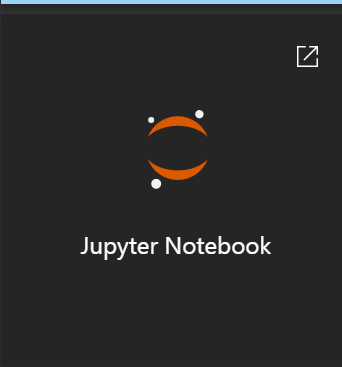
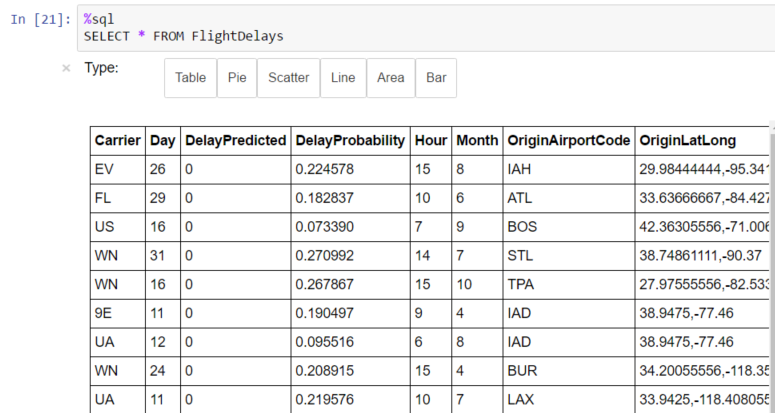

# Exercise 5: Summarize Data Using HDInsight Spark

Duration: 60 mins

Synopsis: In this exercise, attendees will prepare a summary of flight delay data in HDFS using Spark SQL.

## Task 1: Summarize Delays by Airport

1. Navigate to the blade for your Spark Cluster in the Azure Portal.

    

1. In the Quick Links section, click **Cluster Dashboards**.

    

1. From the **Cluster Dashboards** , click **Jupyter Notebooks**.

    

1. A new browser tab should open and you will be prompted for credentials. Log in with the following:
   - User name: **cortana**
   - Password: **Password.1!!**

1. On the **Jupyter notebooks** screen, click on the **New** dropdown list from top right corner and click **Spark**.

    

1. Copy the below text and paste it into the Jupyter notebook.

    

    ```scala
    import sqlContext.implicits._

    sqlContext.sql("DROP TABLE IF EXISTS FlightDelays");

    val flightDelayTextLines = sc.textFile("wasb:///flights/Scored_FlightsAndWeather.csv")

    case class AirportFlightDelays(OriginAirportCode:String,OriginLatLong:String,Month:Integer,Day:Integer,Hour:Integer,Carrier:String,DelayPredicted:Integer,DelayProbability:Double)

    val flightDelayRowsWithoutHeader = flightDelayTextLines.map(s => s.split(",")).filter(line => line(0) != "OriginAirportCode")

    val resultDataFrame = flightDelayRowsWithoutHeader.map(
        s => AirportFlightDelays(
            s(0), //Airport code
            s(13) + "," + s(14), //Lat,Long
            s(1).toInt, //Month
            s(2).toInt, //Day
            s(3).toInt, //Hour
            s(5), //Carrier
            s(11).toInt, //DelayPredicted
            s(12).toDouble //DelayProbability
            )
    ).toDF()

    resultDataFrame.saveAsTable("FlightDelays")
    ```

1. Click the **Play** icon in the top of the screen to execute this code and create the FlightDelays table.

    

1. Click in the empty paragraph below the paragraph in which you entered your Scala script. In this paragraph, you are going to author a SQL query to view the results of the table you just created. In order to switch from running Scala code, to running SQL, your first line in the paragraph must start with %.

    ```scala
    %%sql
    SELECT * FROM FlightDelays
    ```

1. Click on the **Table** button.
2. You should see the results appear in a table form similar to the following:

    

1. Next, you will create a table that summarizes the flight delays data. Instead of containing one row per flight, this new summary table will contain one row per origin airport at a given hour along with a count of the quantity of anticipated delays.
2. In a new paragraph below, try running the following query.

    ```scala
    %%sql
    SELECT  OriginAirportCode, OriginLatLong, Month, Day, Hour, Sum(DelayPredicted) NumDelays, Avg(DelayProbability) AvgDelayProbability 
    FROM FlightDelays 
    WHERE Month = 4
    GROUP BY OriginAirportCode, OriginLatLong, Month, Day, Hour
    Having Sum(DelayPredicted) > 1
    ```

1. Click the **Play** icon in the top of the screen to execute this code.

    

1. This query should return a table that appears similar to the following:

    

1. Since the summary data looks good, the final step is save this summary calculation as a table that we can later query using Power BI.
2. To accomplish creating the table, enter a new paragraph and add the following Scala code and run it.

    ```scala
    sqlContext.sql("DROP TABLE IF EXISTS FlightDelaysSummary");

    val summary = sqlContext.sql("SELECT  OriginAirportCode, OriginLatLong, Month, Day, Hour, Sum(DelayPredicted) NumDelays, Avg(DelayProbability) AvgDelayProbability FROM FlightDelays WHERE Month = 4 GROUP BY OriginAirportCode, OriginLatLong, Month, Day, Hour Having Sum(DelayPredicted) > 1")
    summary.saveAsTable("FlightDelaysSummary")
    ```

1. Click the **Play** icon in the top of the screen to execute this code.

    

1. To verify your table was successfully created, go to another new paragraph and enter and run the following query.

    ```scala
    %%sql
    SELECT * FROM FlightDelaysSummary
    ```

1. Click the **Play** icon in the top of the screen to execute this code.

    

1. You should see results similar to the following:

    

1. You can also click on the other buttons like **Pie** , **Scatter** , **Line** , **Area** , and **Bar** to view these visualizations.

Next Exercise: [Exercise 6 - Visualizing in Power BI Desktop](06 Exercise 6 - Visualizing in Power BI Desktop.md)